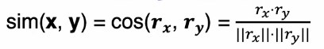
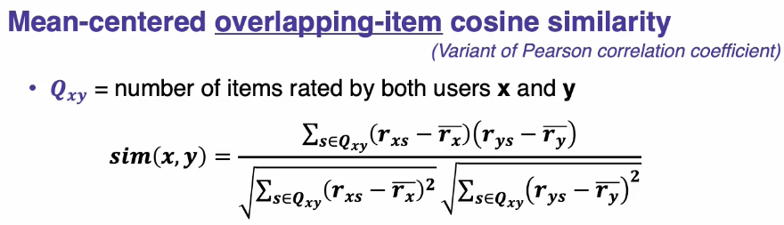
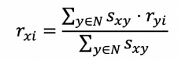

# 협업 필터링(Collaborative Filtering : CF)

## 인프런 강의 정리
### 주요 아이디어
어떤 아이템에 대해 ```비슷한 취향```을 가진 사람들은 ```다른 아이템 또한``` 비슷한 취향을 가질 것이다.  
협업 필터링은 ```취향이 비슷한 사람들 집단```의 존재를 가정하며 시작한다. 

### 유사도 지표
CF에서는 사용자간 ```유사도```를 구하는 것이 핵심이다. 
1. 상관계수
- 가장 이해하기 쉬운 유사도
- -1~1 사이값  
- CF에서는 주로 사용하지는 않는 유사도 지표    

2. ```코사인 유사도```
- CF에서 가장 널리 쓰이는 유사도
- 각 아이템을 하나의 차원으로 보고, 사용자의 평가값을 좌표값으로 본다. 
- 두 사용자의 평가값이 유사하면, 코사인 유사도 값은 커진다. 
- -1~1 사이값
- (주의) 데이터가 이진값(binary)을 가질 때는 코사인 유사도가 아닌 타니모토 계수(Tanimoto coefficient)를 사용하는 것을 권장  

3. 자카드 계수
- 타니모토 계수가 변형된 것
- 데이터가 이진값일 때 유사도 지표로 활용하면 좋음    

### 기본 CF 알고리즘
- 모든 사용자 간의 평가 유사도를 계산  
- 추천 대상과 다른 사용자간의 유사도를 추출  
- 추천 대상이 평가하지 않은 아이템에 대해서 예상 평가값을 계산(평가값 = 다른 사용자 평가 * 다른 사용자 유사도)  
- 아이템 중에서 예상 평가값이 가장 높은 N개를 추천  
<br/>

## 학교 수업내용 정리
### 'User-User' Collaborative Filtering
- Consider user x and unrated item i 
- Find set N of other users **whose ratings are similar to x's ratings** 
- ```Estimate``` **x's ratings for i** based on **ratings for i of users in N**

### Similar Users 찾기 : 코사인 유사도(Cosine similarity measure) 이용


- 코사인 유사도가 0에 가까울수록 두 객체는 유사하다!
- Problem with Raw Cosine : Treats missing ratings as 'negative'
- Solution : ```Mean-Centered``` Utility Matrix를 이용! 
  - row에 row 원소들의 평균값(means)을 빼서 Mean-Centered Utility Matrix를 구할 수 있음
  - 정규화(Normalization)와는 다름

- Solution2 : Overlapping-Item Mean-Centering 
  - 두 User가 모두 평점을 준 아이템만 가지고 코사인 유사도를 구하자! 
  

### 평점 예측하기
1. 사용자와 비슷한 유저들이 item i에 매긴 평점의 평균값으로 예측하기
2. (Even better) (다른 사용자 평가 * 다른 사용자와의 코사인 유사도)의 총합 / 코사인 유사도
     


