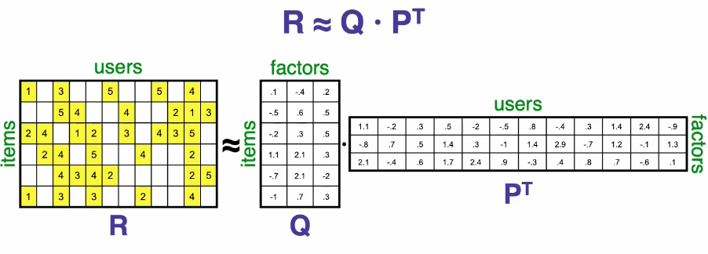
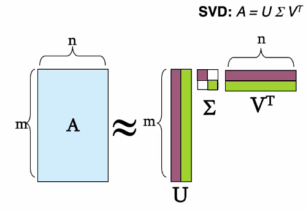
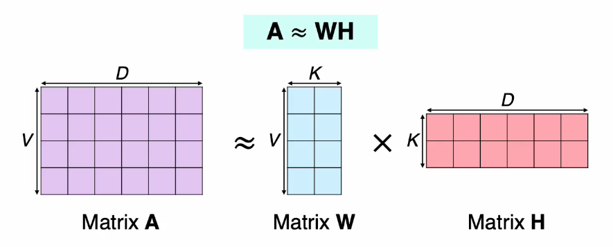

# Latent Factor Models 

### Introduction 
- ```컨텐츠 기반 필터링```은 각 사용자나 아이템에 대해 **프로필**을 만들고, 그 특성을 구체화하는 방식으로 이루어진다. 
- 반면 위 방식의 대안이라고 할 수 있는 ```협업 필터링```은 어떤 **명시적(Explicit) 프로필을 만들지 않고**, 이전 구매 기록이나 제품 평가 기록 등 **과거 사용자 행동에만 의존**해서 시스템을 구성한다. 이 방식은 유저-아이템 간의 상관관계를 찾아내는 것이 주 목적이라고 할 수 있다.
- 협업 필터링은 Domain-free 즉, 특별히 이 분야에 대한 지식이 필요하지 않다는 장점을 가진다. 반면 새로운 사용자와 아이템을 다루기에 부적합하다는 Cold Start Problem이라는 한계를 갖고 있다.
- 협업 필터링의 종류
  - 근접 이웃 방법(Neighborhood methods)
  - ```잠재 요인 방법(Latent factor models)``` : 20~100가지의 factor(요인)을 추론하는 것이 목적
<br/>

### Latent Factor Models
- Latent Factor Models를 구현하는 가장 좋은 방법 중 하나는 ```Matrix Factorization```이다.(e.g, SVD, NMF, ALS)
  
- Matrix Factorization 모델은 사용자와 아이템 모두를 차원 f의 결합 잠재요인 공간에 매핑하는데, 사용자-아이템 상호작용은 이 공간에서 내적으로 모델링 된다.
- 아이템 i는 **qi**로, 사용자 u는 **pu**라는 **벡터**로 표현된다. 이 둘의 내적은 **사용자-아이템 사이의 상호작용**을 반영하며 이는 곧 아이템에 대한 사용자의 전반적인 관심을 표현한다고 볼 수 있다.
<br/>

### SVD(Singular Value Decomposition)


- A : Input data matrix
- U : Left singular vectors
- sigma : Singular values
- V : Right singular vectors
- SVD의 Cost Function인 ```SSE(Sum of Squared Errors)``` 값을 최소로 하는 것을 목표로 함!
- Problem : 입력 행렬의 missing values를 모두 0으로 채워 모든 원소에 대해 계산하기 때문에 예측 성능을 떨어뜨릴 수 있다. 
<br/>

### NMF(Non-negative Matrix Factorization)


- Matrix A, W, H 모두 원소값들이 음수값이 아니여야 한다.(non-negative)

